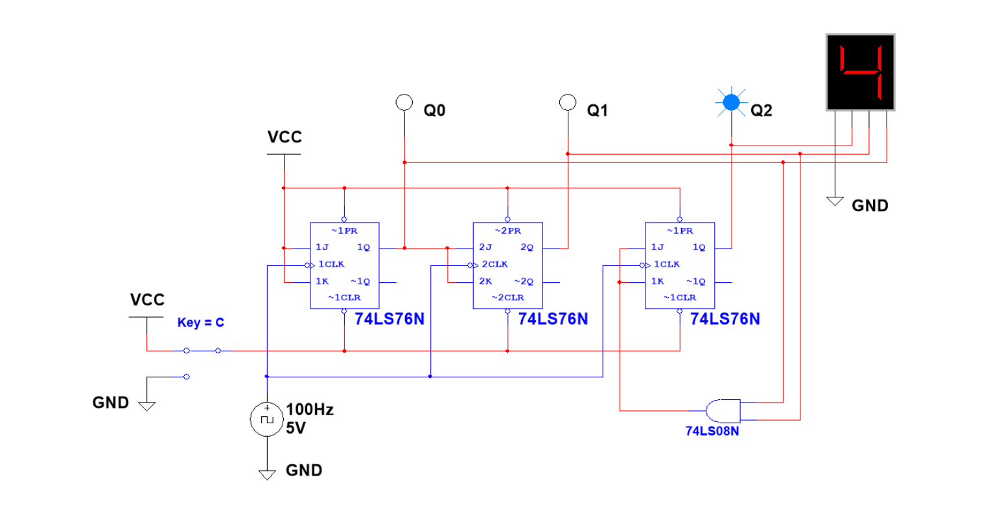
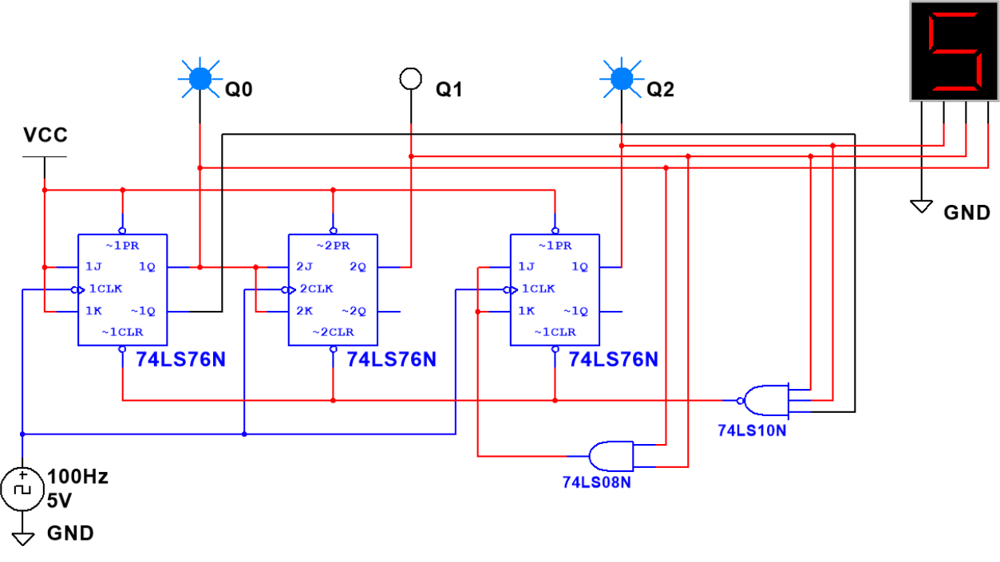

# Activity 3.3.1 — Synchronous Counters: Small-Scale Integration (SSI)

As you observed in the previous lesson, asynchronous counters are very simple to design but have a characteristic clock ripple that can cause problems in some applications. This rippling effect can be eliminated with the use of the synchronous or parallel counter. With synchronous counters, all the flip-flops are clocked simultaneously, thus eliminating the clock ripple and its associated problems.

In this activity, you will simulate and analyze several 3-bit synchronous counters. Record all observations, answers to inline questions, and responses to Reflection and Conclusion questions in your PLTW Engineering Notebook.

---

## Synchronous Counters

**1.** Review the **Synchronous Counters** presentation.

**2.** The circuit shown in Figure 1 is a Synchronous 3-bit Binary **Up Counter** implemented with 74LS76 J/K flip-flops. This design will count from 0 to 7 and then repeat.

*Figure 1. Synchronous 3-Bit Binary Up Counter with J/K Flip-Flops*

- Using CDS, enter the Synchronous 3-bit Binary Up Counter.
- With the RESET switch set to 5 V, start the simulator. Verify that the circuit is working as expected. If the results are not what is expected, review your circuit and make any necessary corrections. You may need to adjust the simulation speed to be able to observe the outputs changing.
- With the simulation running, toggle the RESET switch to GROUND. What effect does this have on the output? **Record your answer in your Engineering Notebook.**
- Toggle the RESET switch back to 5 V. What effect does this have on the output? **Record your answer in your Engineering Notebook.**
- Finally, observe the HEX DISPLAY. Notice that unlike the asynchronous counters analyzed in a previous lesson, the numbers displayed on the HEX DISPLAY transition smoothly.

> **Reflection — answer in your Engineering Notebook:**
> Why don't these values jump between some count changes like they did with asynchronous counters?

**3.** Modify the circuit in step 2 to make it a Synchronous 3-bit Binary **Down Counter**. Repeat step 2 for this modified counter. **Record your observations in your Engineering Notebook.**

**4.** The circuit shown in Figure 2 is a Synchronous Mod-6 Binary-Up Counter implemented with 74LS76 J/K flip-flops. This design will count from 0 to 5 and then repeat. This Mod-6 counter uses a three-input NAND gate to generate an asynchronous reset to the clear inputs of the flip-flops when the count reaches six (110).

*Figure 2. Synchronous Mod-6 Binary Up Counter*

**5.** Using CDS, enter the Synchronous MOD-6 Binary Up Counter.

- Start the simulator and verify that the circuit is working as expected. If the results are different than what is expected, review your circuit and make necessary corrections. You may need to adjust the simulation speed to be able to observe the outputs changing.
- Modify this design to count from 0 to 4 and then repeat the count. **Record your modified schematic and results in your Engineering Notebook.**

---

## Conclusion Questions

Answer each of the following questions in your PLTW Engineering Notebook.

**Question 1.** What are the advantages of synchronous counters over asynchronous counters?

**Question 2.** Do asynchronous counters have any advantages?

**Question 3.** What changes must be made to a 3-bit counter to make it a 4-bit counter?
