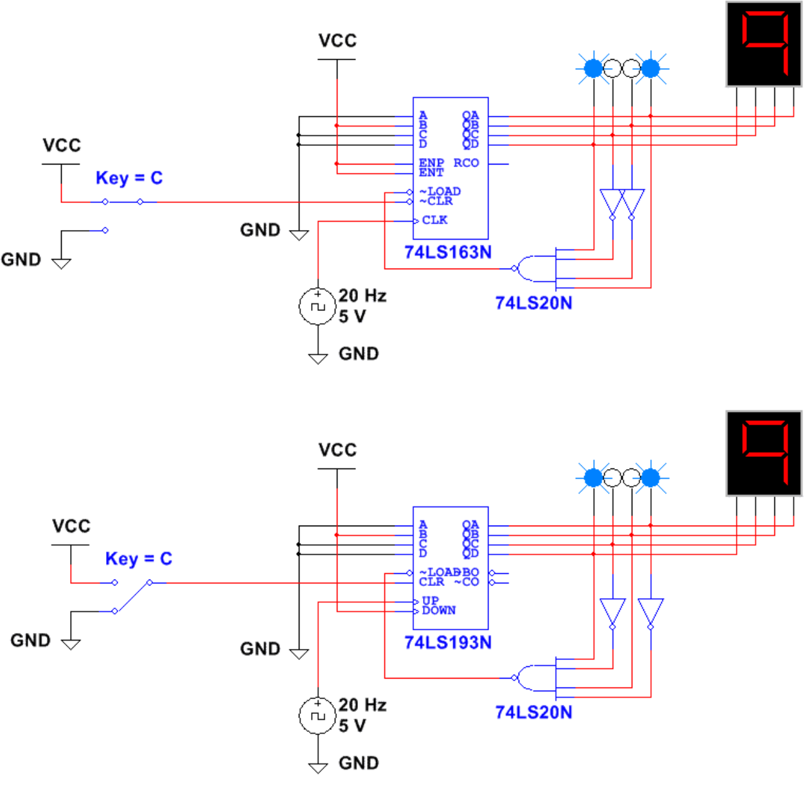
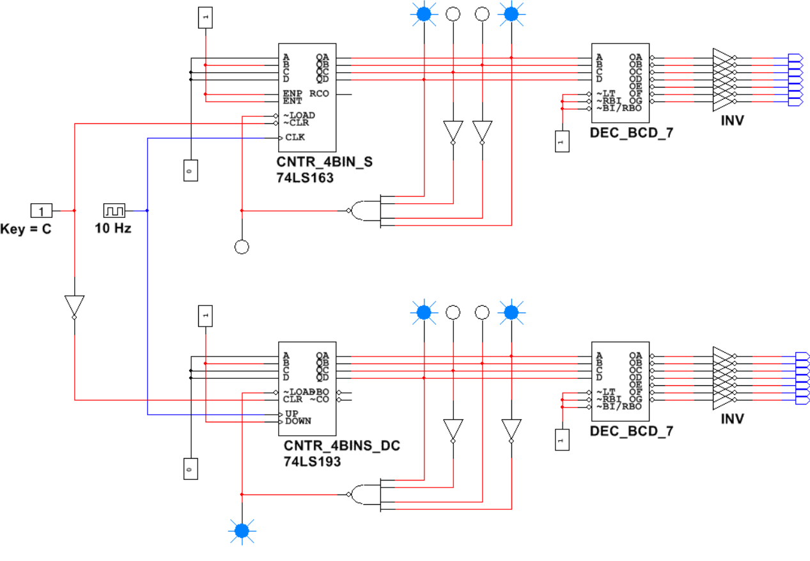
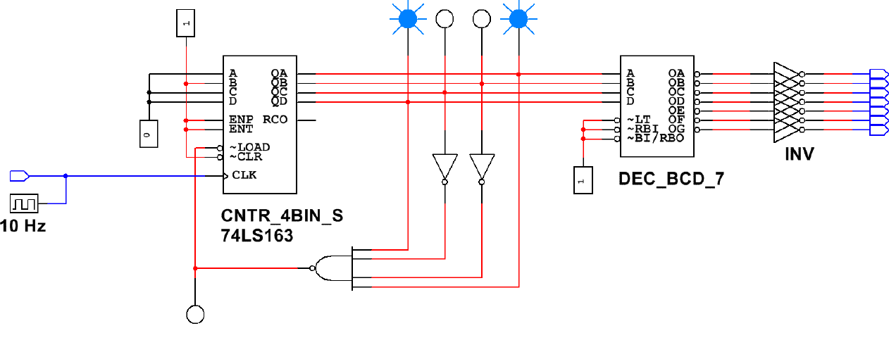
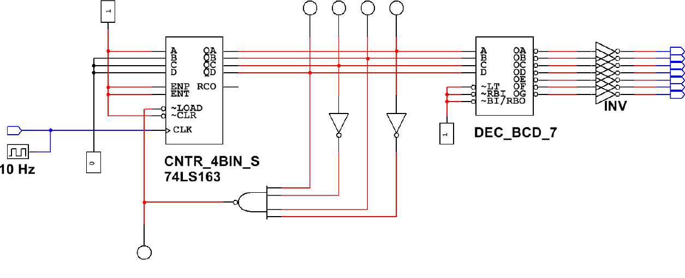

# Activity 3.3.2 — Synchronous Counters: MSI 74LS163 Up Counter Using PLTW S7

Several medium-scale integrated (MSI) circuit counter chips are available to digital designers who need a binary up counter as part of their new design. Each of these ICs has its own unique set of features. Matching these features to the needs of the design will determine which IC is best suited for the particular application.

For the sake of time in this activity, you will limit your designs to the 74LS163 Synchronous 4-bit Binary Counter IC. No feature makes this particular counter better than the others; it is just a representative sample of the different MSI counter ICs available.

A unique feature for 74LS163 is that the LOAD is a synchronous input. This means the data input will be loaded into the counter on the next rising edge of the clock when the LOAD input is a logic (0). In previous designs, the "reset" was defined as the count plus 1 for up counters, and the count minus 1 for down counters. For the 74LS163, the "reset" is defined by the count limit. (Example: if the desired count range is 2 to 7, the LOAD "reset" is wired for the number 7. The number "7" will display, and the count will reset or LOAD on the transition from 7 to 8.)

In this activity, you will simulate and build counters that were designed using the 74LS163 Synchronous 4-bit Binary Counter IC. Record all observations, answers to inline questions, and responses to Conclusion questions in your PLTW Engineering Notebook.

---

## Synchronous Counters with MSI Gates

**1.** Review the **Synchronous Counters with MSI Gates** presentation.

### Simulation (Design Mode)

**2.** Using the Design Mode of the CDS, enter the two MSI Synchronous Counters shown in Figure 1. The circuits are a 74LS163 Up Counter with synchronous load and a 74LS193 Up/Down Counter with asynchronous load.

*Figure 1. Two MSI Synchronous Counters — Design Mode*

**3.** Observe the corresponding MSI counters in PLD Mode as shown in Figure 2.

*Figure 2. Two MSI Synchronous Counters — PLD Mode*

### Simulation (PLD Mode)

The circuit in Figure 3 is a 4-bit Binary Up Counter designed to count from 2 to 9. This counter is designed with the PLD Mode version of the 74LS163 MSI Counter IC.

*Figure 3. A 4-bit Binary Up Counter — PLD Mode*

**4.** Using the PLD Mode of the CDS and the 74LS163, enter the 2 to 9 Binary Up Counter. By monitoring the logic probes attached to outputs QD, QC, QB, and QA, verify that the circuit is working as expected (Is the count 2 to 9?). If the results are not as expected, review your circuit and make the necessary corrections.

- Make the necessary modifications to the counter design to change the count from 4 to 8. Using CDS, verify that the circuit is working as expected. If the results are not as expected, review your circuit and make any necessary corrections. **Record your modified schematic in your Engineering Notebook.**
- Using the DLB, build and test the 4 to 8 counter that you just designed and simulated. Verify that the circuit is working as expected and that the results match the results of the simulation. **Document your results in your Engineering Notebook.**

---

## Conclusion Questions

Answer each of the following questions in your PLTW Engineering Notebook.

**Question 1.** What are the advantages of implementing a synchronous counter with the 74LS163 integrated circuit versus using discrete flip-flops and gates?

**Question 2.** In previous counters that you have created, you set the LOAD as the value just past the last digit you wanted displayed. That is not the case with this design. Why is the way you set the range different for this design?

**Question 3.** Analyze the counter shown in Figure 4 to determine the counter's lower and upper count limits. Show your analysis in your Engineering Notebook.

*Figure 4. A Counter Circuit*
