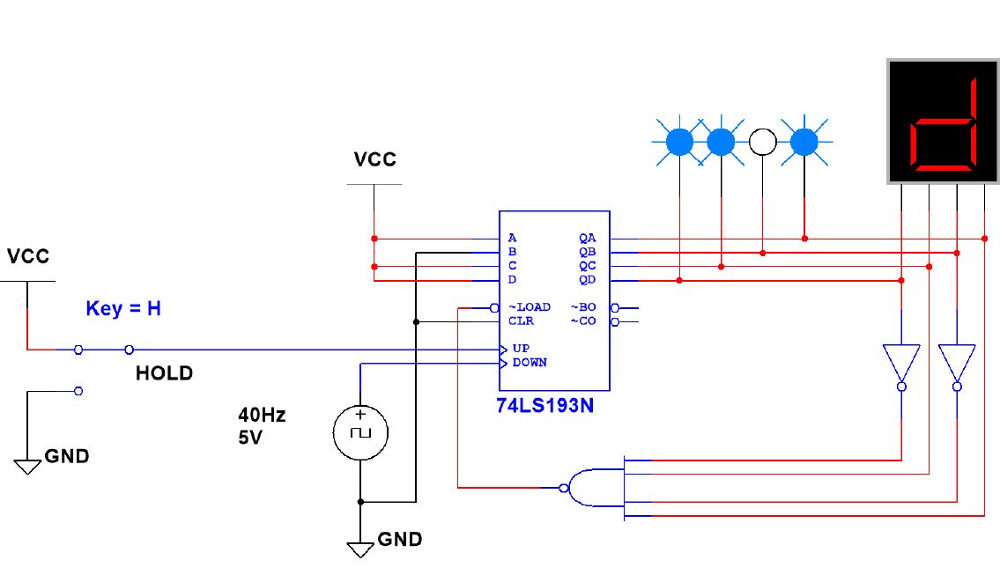
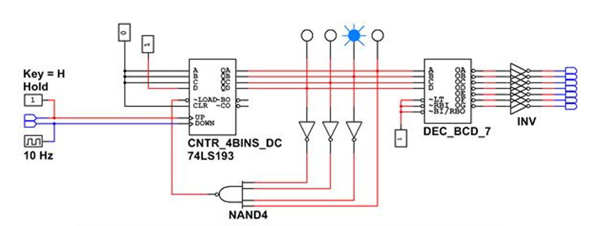
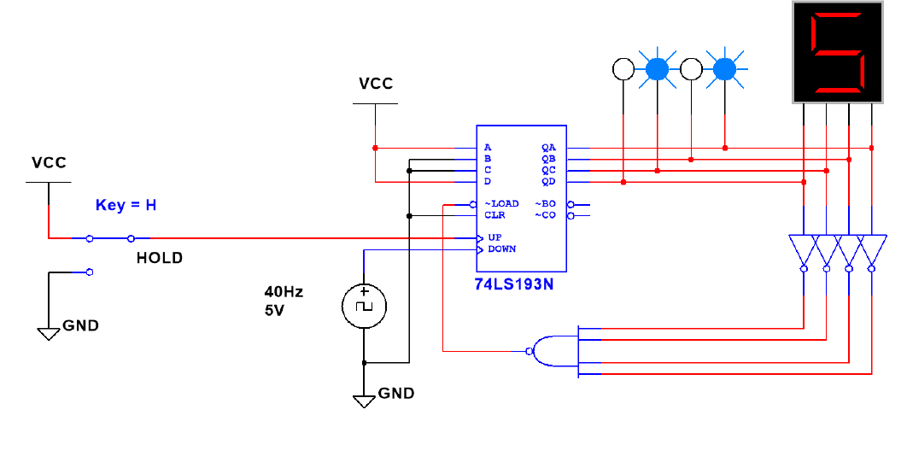

# Activity 3.3.3 — Synchronous Counters: MSI 74LS193 Up/Down Counter Using PLTW S7

In the last activity, you began your study of MSI synchronous counters by examining the 74LS163 Synchronous 4-bit Binary Counter IC. While this IC works for many applications, it lacks one feature. The 74LS163 functions only as an up counter. If your design calls for a down counter, that IC will not work.

For applications that call for a down counter, the 74LS193 Synchronous 4-bit Binary Counter IC is the IC of choice.

In this activity, you will simulate and build counters designed using the 74LS193 Synchronous 4-bit Binary Counter IC. Record all observations, answers to inline questions, and responses to Conclusion questions in your PLTW Engineering Notebook.

---

## Design and Simulate

### Design Mode

The circuit in Figure 1 is a 4-bit Binary Down Counter created in Design Mode. It is designed to count from 13 to 6 with the 74LS193 MSI Counter IC.

*Figure 1. A 13 to 6 Binary Down Counter*

**1.** Using the Design Mode of the CDS, enter the 13 to 6 Binary Down Counter. By monitoring the logic probes attached to outputs QD, QC, QB, and QA, verify that the circuit is working as expected (Is the count 13 to 6?). If the results are not as expected, review your circuit and make any necessary corrections. **Record your observations in your Engineering Notebook.**

**2.** Using the Design Mode of the CDS, make the necessary modifications to the counter design to change the count to a 6 to 13 Binary-Up Counter. Verify that the circuit is working as expected. If the results are not as expected, review your circuit and make the necessary corrections. **Record your modified schematic and results in your Engineering Notebook.**

### PLD Mode

**3.** The circuit in Figure 2 is a 4-bit Binary Down Counter created in PLD Mode. It is designed to count from 8 to 2 with a CNTR_4BINS_DC, which is the PLD equivalent of the 74LS193 in Design Mode.

*Figure 2. A 13 to 6 Binary Down Counter in PLD Mode*

- The CNTR_4BINS_DC (PLD Mode version of the 74LS193) is a Synchronous 4-bit Binary Up/Down Counter with two Clocks.
- The two Clocks are designed to receive only clock signals. You cannot tie the UP or DOWN to a 1 or 0.
- If creating this circuit in PLD Mode, you must connect the Down count (Hold) to a switch or an input of 5 V.

**4.** Using the PLD Mode of the CDS, enter the 8 to 2 Binary-Down Counter. By monitoring the logic probes attached to outputs QD, QC, QB, and QA, simulate and verify that the circuit is working as expected (i.e., Is the count 9 to 2?). If the results are not as expected, review your circuit and make any necessary corrections. **Record your results in your Engineering Notebook.**

**5.** Using the PLD Mode of the CDS, make the necessary modification to the counter design to change the count to a 2 to 8 Binary Up Counter. Export the design to your PLD and verify that the circuit is working as expected. **Record your results in your Engineering Notebook.**

---

## Conclusion Questions

Answer each of the following questions in your PLTW Engineering Notebook.

**Question 1.** What are the advantages of implementing a synchronous counter with the 74LS193 IC over the 74LS163 IC?

**Question 2.** What is the difference between a synchronous load input (74LS163) and an asynchronous load input (74LS193)?

**Question 3.** Analyze the counter in Figure 3 to determine the counter's lower and upper count limit. Show your analysis in your Engineering Notebook.

*Figure 3. A Binary Counter*
