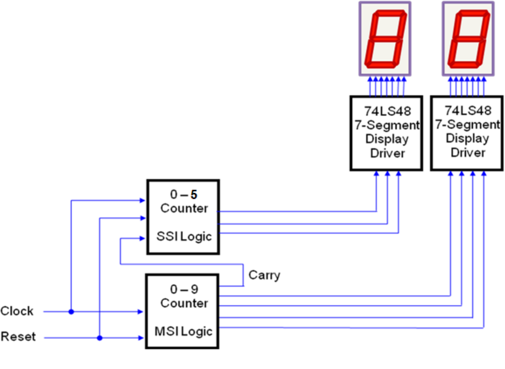

# Problem 3.3.4 — Synchronous Counters: Sixty-Second Timer Using PLTW S7

In this design problem, you have the opportunity to draw together all of the concepts and skills that you have developed pertaining to synchronous counter design. You will design, simulate, and create a Sixty-Second Timer. Record all design work, observations, and responses to Reflection questions in your PLTW Engineering Notebook.

---

## Sixty-Second Timer Design Challenge

### Design (Sixty-Second Timer)

Design a digital Sixty-Second Timer that counts from 00 to 59. This design has two control inputs and two output displays. The two inputs are **Clock** and **Reset**. The **Clock** signal is a 1 Hz square wave that controls the count rate. The **Reset** signal, when it is a logic zero, resets and holds the count at zero. When the **Reset** signal is a logic 1, counting is enabled. When the count reaches sixty seconds, the counting resets at 0.

*Figure 1. Sixty-Second Timer — Block Diagram*

### Design Specifications

- The two output displays are common cathode seven-segment displays that require a multiplexed signal.
- Each display will use a 74LS48 BCD-to-Seven-Segment display driver in Design Mode and a DISPLAY7 in PLD Mode.
- The Units digit counter will be a 74LS163 BCD Up Counter that counts from 0 to 9.
- The Tens digit counter will be a 74LS163 counter that counts from 0 to 5.
- The Tens counter will use the Ripple Carry Output (RCO) of the Units counter as its clock input.

### Design Steps

Complete the following design steps. **Record all design work in your Engineering Notebook.**

**1.** Draw a complete schematic of the Sixty-Second Timer. Include all inputs, outputs, and interconnections.

**2.** Using CDS in Design Mode, enter and simulate your Sixty-Second Timer design. Verify that the circuit counts correctly from 00 to 59. **Record your results in your Engineering Notebook.**

**3.** Make any necessary corrections to your design, then convert it to PLD Mode. Enter and simulate the PLD Mode version of your design. **Record your results in your Engineering Notebook.**

**4.** Export your PLD Mode design to the PLTW S7 board. Demonstrate the working Sixty-Second Timer to your teacher. **Record your observations and any final notes in your Engineering Notebook.**

### Ethical Scenario

You are a junior engineer at a firm that has been contracted to develop a timing system for a public event. Your manager asks you to cut costs by reusing components from a previous project that have not been fully tested for reliability under the new operating conditions. Consider the following:

- What are the potential risks of using components that have not been fully validated for the new application?
- What would you do if your manager pressured you to proceed despite your concerns?
- **Record your response and reasoning in your Engineering Notebook.**

---

## Conclusion Questions

Answer each of the following questions in your PLTW Engineering Notebook.

**Question 1.** Describe the role of the Ripple Carry Output (RCO) in the Sixty-Second Timer design. Why is it used as the clock input for the Tens counter?

**Question 2.** What modifications would be needed to convert this Sixty-Second Timer into a Sixty-Minute Timer?

**Question 3.** Explain the difference between the Design Mode and PLD Mode implementations. What advantages does the PLD Mode offer?
